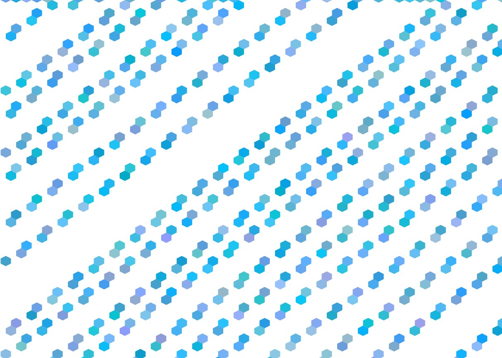
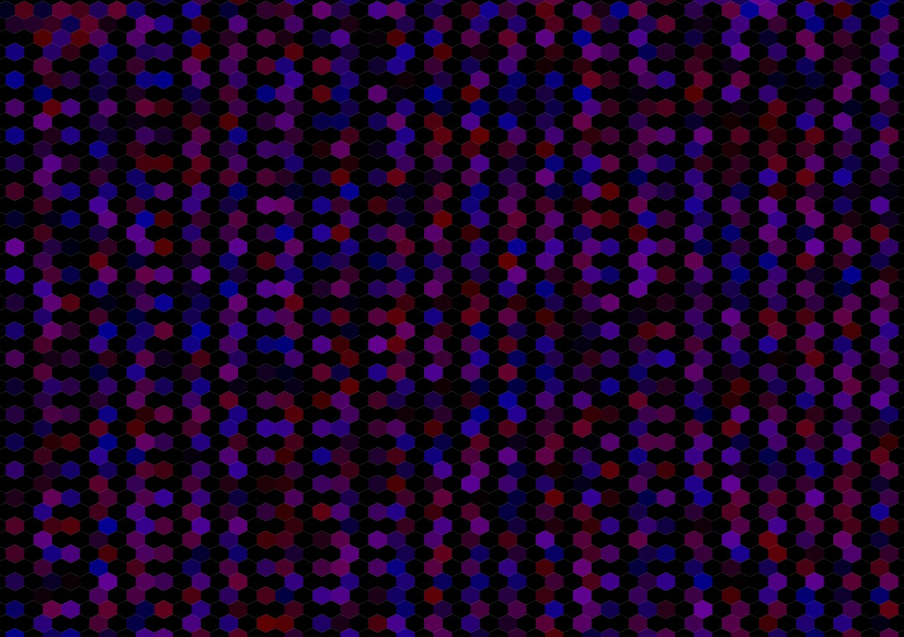
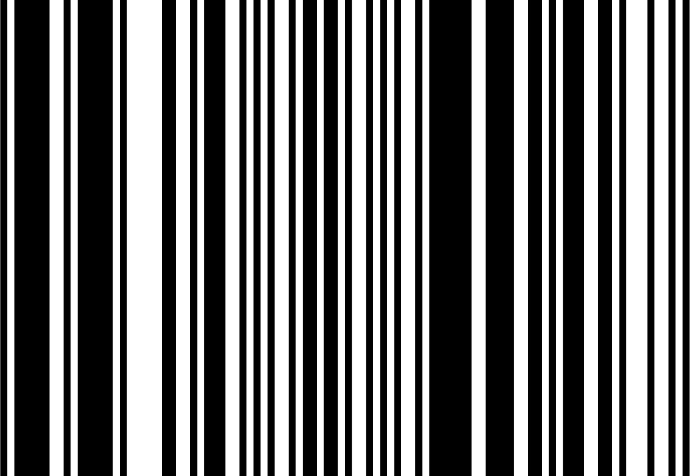
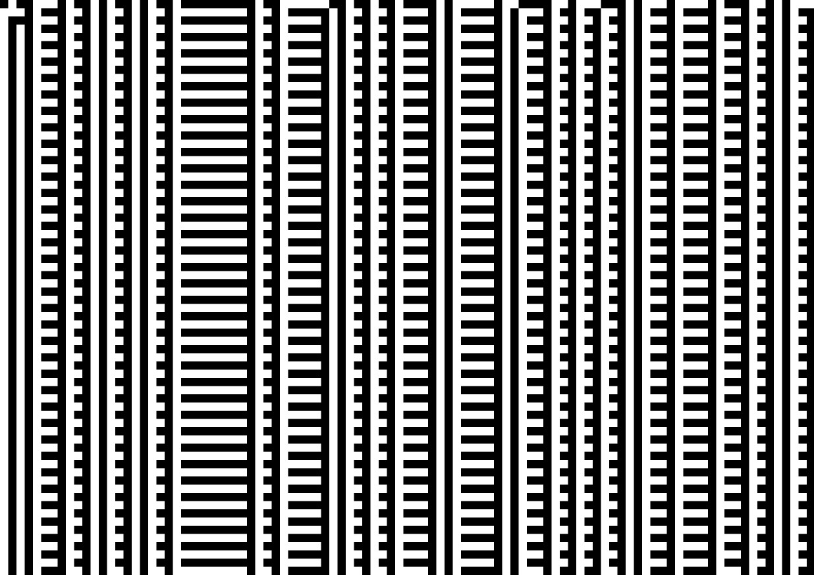
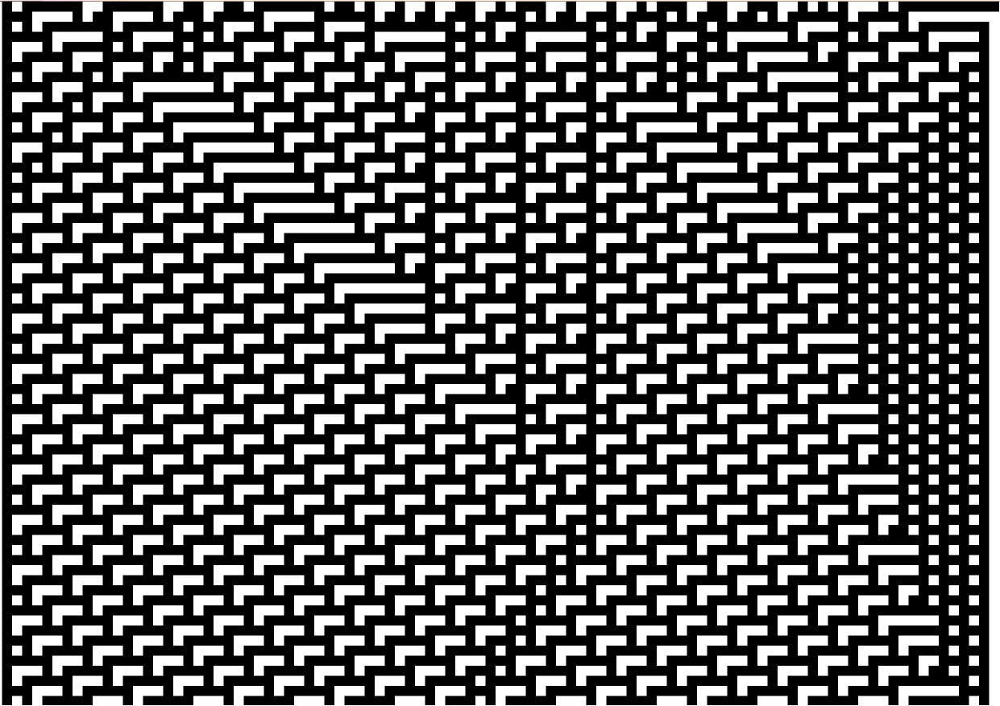

# Introduction

The CA used for creating artworks is the most basic one, Wolfram CA or elmentary CA. The file `sketch.js` which is used by p5.js generates the artwork confined to the rules of the Wolfram CA. The code in `sketch.js` is a modified version found [in the p5.js website](https://p5js.org/examples/simulate-wolfram-ca.html).

### How to Run
Clone the repository and just run the `index.html` file and you're good to go. Refresh for a fresh iteration of the CA.

### How to Edit
Modify the file called `sketch.js` which contains the rules used in the Wolfram CA and functions to draw shapes. It is recommended to install p5.vscode and live server when using VS Code to edit.

# Modifications to the Code
I made changes to the code in an attempt to 'spice up' the automata a little bit. I drawn inspiration for some of these changes from the exercises found in [Nature of Code Website](https://natureofcode.com/book/chapter-7-cellular-automata/).

### Randomization of the Ruleset
Originally, the initial ruleset indicated in the original file is `{0,1,1,0,1,1,0,1}`. I have added a function below that will randomize the ruleset whenever the html reloads.
```js
function generateRuleset() {
  ruleset = [];
  for (let i = 0; i < 8; i++) {
    ruleset.push(Math.floor(Math.random() * 2));
  }
  return ruleset;
}
```
### Randomization of the First Generation
The initial array contained zeroes and a one in the middle of the array. I changed the algorithm to randomize the first row so we could explore more patterns. This is a snippet in the setup function.
```js
for (let i = 0; i < cells.length; i++) {
    cells[i] = Math.floor(Math.random() * 2);
}
```
### Changing the Shape
The Nature of Code chapter insinuates that we should not be bound by the shape of the cell. So I tried implementing hexagons for other artworks. This is a snippet in the draw function.
```js
hexagon((generation%2) * w + 2 * i * w, generation * (w + 5), w, 1);
```
# Generated Artworks
### Proposed Name: Bee Colony

Using the yellow and black color, I managed to create an artwork that looks like a swarm of bees. I also somehow look like the bees are in the shape of spaceships.

The ruleset used here is [1,0,0,0,0,0,0,1] or Rule 129.

### Proposed Name: Ambient Drizzle

Shades of blue reminds me of rain, shades of light blue exudes calmness and ambience.

The ruleset used here is [0,1,0,0,0,0,1,0] or Rule 66.

### Proposed Name: Darkness Prison

Shades of blue and red paints the jail cell bars. Red reminds me of blood and blue represents the ice cold. The artwork exudes a feeling of darkness and hopelessness.

The ruleset used here is [1,0,1,1,0,0,1,1] or Rule 179.
### Proposed Name: Barcode

Thick and thin stripes represent a barcode.

The ruleset used here is [1,1,0,0,1,1,0,0] or Rule 204.

### Proposed Name: Skyscrapers

Horizontal lines kind of look like the floors of a tall building, on the other hand the shorter ones look like the elevantors to that building.

The ruleset used here is [0,0,0,1,1,1,0,1] or Rule 29.
### Proposed Name: Blocks

One of my favorites, since everything seeems to fit together. The white parts reminds me of the L-shaped tetris blocks.

The ruleset used here is [0,0,0,0,0,1,0,1] or Rule 5.

# References
- [p5.js](https://p5js.org/) - a library that helps draw code
- [Nature of Code by Daniel Shiffman](https://natureofcode.com/book/chapter-7-cellular-automata/) - a great website that teaches you about the wonders of cellular automata
